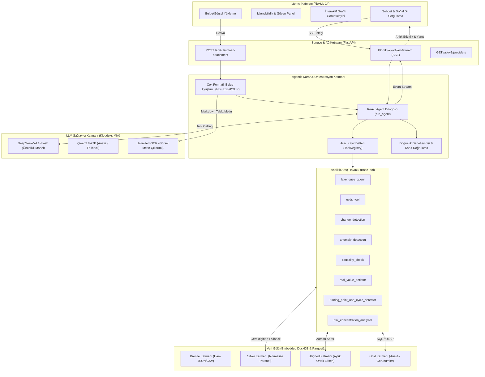
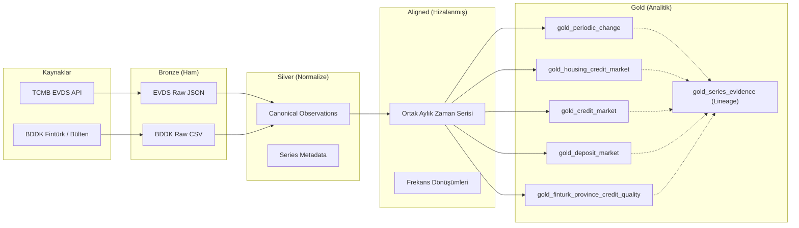

# NovaData KKB — NOVA Analytics Agent

**🌐 Canlı Sistem:** _(20 Eylül'de eklenecek)_  
**🎬 Demo Videosu:** _(20 Eylül'de eklenecek)_

Türkiye finans/kredi verilerini (EVDS, BDDK) tek bir Lakehouse'ta toplayıp, kaynağı izlenebilir ve araç-çıktılarına dayalı cevaplar üreten bir LLM ajanı ve API/arayüzü.

> **📌 Hackathon Değerlendirme Kriterleri & Hızlı Erişim:**
> - [x] **Projenin Genel Mimari Tasarımı (Diyagram ve Akış Şemaları):** [Bölüm 1'e Git](#1-genel-mimari-tasarımı-ve-akış-şemaları)
> - [x] **Projenin Modüler Kod Yapısı:** [Bölüm 2'ye Git](#2-projenin-modüler-kod-yapısı)
> - [x] **Doküman Okuma Süreçlerinde Kullanılan Yaklaşım / Agent Yapısı:** [Bölüm 3'e Git](#3-doküman-okuma-süreçleri-ve-çok-modlu-multimodal-yaklaşım)
> - [x] **Agentic Mimarinin Karar Alma ve Görev İşleme Tasarımı:** [Bölüm 4'e Git](#4-agentic-mimari-karar-alma-ve-görev-işleme-tasarımı)

---

## 1. Genel Mimari Tasarımı ve Akış Şemaları

NOVA Analytics Agent; veri toplama, analitik dönüştürme, çok modlu doküman işleme, LLM araç orkestrasyonu ve izlenebilir görsel arayüzü tek bir uçtan uca mimaride birleştirir.

### 1.1 Uçtan Uca Sistem Mimarisi



### 1.2 Medallion Veri Akış Şeması



---

## 2. Projenin Modüler Kod Yapısı

NOVA, Tek Sorumluluk İlkesi (Single Responsibility Principle) ve Katmanlı Mimari (Layered Architecture) prensipleriyle tasarlanmıştır. Her modül kendi bağımsız sorumluluk alanına sahiptir:

```
c:/Projects/kkb/
├── backend/
│   ├── app/
│   │   ├── agent/                 # Agentic Çekirdek
│   │   │   ├── loop.py            # ReAct döngüsü, hafıza yönetimi, paralelleştirme
│   │   │   └── tool_registry.py   # Araç kayıt defteri ve OpenAI tool formatı dönüştürücü
│   │   ├── prompts/               # Sistem promptları ve guardrail tanımları (system_prompt.md)
│   │   ├── tools/                 # Bağımsız Analitik Araçlar (BaseTool türevleri)
│   │   │   ├── base.py            # BaseTool soyut sınıfı ve ortak doğrulama kontratı
│   │   │   ├── lakehouse_query.py # DuckDB SQL çalıştırma ve güvenli şema sorgulama
│   │   │   ├── evds_tool.py       # Canlı EVDS sorgulama ve Silver'a anlık yazma
│   │   │   ├── change_detection.py# Trend ve değişim analiz motoru
│   │   │   ├── anomaly_detection.py# İstatiksel anomali tespit motoru
│   │   │   ├── causality_check.py # Granger nedensellik ve korelasyon analizleri
│   │   │   ├── real_value_deflator.py # TÜFE ile enflasyondan arındırma motoru
│   │   │   └── ...                # 11+ bağımsız analitik araç
│   │   ├── services/              # Yardımcı ve Destekleyici Servisler
│   │   │   ├── attachment_parser.py # PDF, Excel, CSV ve Görsel ayrıştırma motoru
│   │   │   ├── grounding.py       # Cevap-veri doğruluk kontrolü (Grounding)
│   │   │   └── evds_loader.py     # EVDS veri çekme ve normalize etme servisi
│   │   ├── core/                  # Çekirdek Altyapı
│   │   │   └── llm_provider.py    # KloudeksProvider, retry/backoff, model yönetimi
│   │   ├── modules/               # Domain ve Katman Modülleri
│   │   │   ├── llm/kloudeks.py    # DeepSeekFlash, Qwen ve OCR istemcileri
│   │   │   ├── evds/              # EVDS API istemcisi ve anahtar havuzu rotasyonu
│   │   │   └── gold/              # Gold katmanı türetim scriptleri ve tabloları
│   │   └── api/                   # Web Katmanı
│   │       ├── routes.py          # SSE akışlı chat, upload ve provider endpoint'leri
│   │       └── main.py            # FastAPI uygulama başlatıcı ve CORS ayarları
│   └── tests/                     # 320+ Kapsamlı Test Paketi
│       ├── agent/                 # Döngü, hafıza ve prompt testleri
│       ├── tools/                 # Her bir aracın tekil ve entegre testleri
│       └── services/              # Belge ayrıştırıcı ve grounding testleri
├── frontend/                      # Modern Next.js 14 Web Arayüzü
│   ├── app/[locale]/              # App Router, çok dilli yapı (i18n: TR/EN)
│   ├── messages/                  # Dil çeviri sözlükleri
│   └── components/                # Modüler UI bileşenleri
└── data/                          # Yerel Medallion Veri Katmanları (Bronze/Silver/Gold)
```

---

## 3. Doküman Okuma Süreçleri ve Çok Modlu (Multimodal) Yaklaşım

Kullanıcıların yüklediği harici verileri ve dokümanları analiz edebilmek için sistemde gelişmiş bir **Çok Modlu Doküman İşleme Motoru** (`backend/app/services/attachment_parser.py`) yer alır:

### 3.1 Desteklenen Formatlar ve İşleme Yöntemleri
1. **Excel (`.xlsx`, `.xls`):**
   - `openpyxl` ve `xlrd` motorlarıyla çalışma sayfaları (sheets) taranır.
   - Sayısal formatlar, tarihler ve boş hücreler temizlenerek LLM'in en iyi anlayabileceği Markdown tablolarına dönüştürülür.
2. **CSV (`.csv`):**
   - Otomatik ayırıcı tespiti (`csv.Sniffer` ile virgül veya noktalı virgül ayrımı).
   - Veri tipi denetimi ve büyük dosyalarda özet/tablo optimizasyonu.
3. **PDF (`.pdf`):**
   - `pypdf` kütüphanesiyle metinsel ve tablosal içerik sayfalandırılarak çekilir.
   - Eğer PDF salt taranmış belgelerden oluşuyorsa (dijital metin yoksa), sayfalar otomatik olarak OCR modülüne aktarılır.
4. **Görseller (`.png`, `.jpg`, `.jpeg`, `.webp`):**
   - Kloudeks altyapısındaki **`Unlimited-OCR`** ve **`Qwen3.8-27B`** vision modelleri kullanılarak görseldeki bilanço tabloları, grafik değerleri ve metinler %99+ doğrulukla ayıklanır.

### 3.2 Dokümanın Agent Döngüsüne Entegrasyonu & Güvenlik
- **Sandboxed Context (İzole Bağlam):** Ayıklanan doküman içeriği, prompt enjeksiyonuna (Prompt Injection) karşı `format_attached_document` fonksiyonuyla özel sınırlandırıcı etiketlerle sarılır.
- **Çapraz Sorgulama Yeteneği:** Ajan, yüklenen dosyadaki verileri yalnızca okumakla kalmaz; DuckDB'deki makroekonomik verilerle (EVDS enflasyon, faiz, kredi hacmi) çaprazlayarak harici dosya ile resmi verileri karşılaştırabilir.

---

## 4. Agentic Mimari: Karar Alma ve Görev İşleme Tasarımı

NOVA, statik bir sorgu motoru değil; dinamik olarak planlayan, uygulayan ve kendi kendini düzelten bir **ReAct (Reasoning + Acting)** döngüsüne sahiptir.

### 4.1 Karar Alma Mekanizması (Decision Making)
1. **Düşünce (Reasoning):** Model, kullanıcının sorusunu aldığında doğrudan tahmin yürütmek yerine hangi verilere ve araçlara ihtiyaç duyduğunu planlar.
2. **Fonksiyon Çağırma (Function Calling):** OpenAI uyumlu `tools` şeması üzerinden parametrelerini belirleyerek tekil veya paralel araç çağrıları üretir.
3. **Paralel Araç Çağrısı (Parallel Execution):** Birbiriyle bağımsız araçlar (örneğin hem enflasyon hem kredi büyümesi çekilecekse) eşzamanlı olarak çalıştırılarak yanıt süresi kısaltılır.

```mermaid
sequenceDiagram
    autonumber
    actor User as Kullanıcı
    participant UI as Next.js Arayüz
    participant API as FastAPI (SSE)
    participant Loop as Agent Döngüsü
    participant LLM as DeepSeek-V4.1-Flash
    participant Tools as Analitik Araçlar (DuckDB/EVDS)

    User->>UI: "2024 konut kredisi faizi ve konut satışları ilişkisi nedir?"
    UI->>API: POST /api/v1/ask/stream
    API->>Loop: run_agent() başlat
    Loop->>LLM: Sistem Promptu + Soru + Araç Şemaları
    LLM-->>Loop: Karar: lakehouse_query(gold_housing_credit_market)
    Loop->>API: Event: llm_decision (Araç: lakehouse_query)
    API-->>UI: SSE: "Araç çalıştırılıyor: lakehouse_query"
    Loop->>Tools: SQL sorgusu çalıştır (DuckDB)
    Tools-->>Loop: 2024 Aylık Veriler (Faiz, Endeks, Satış)
    Loop->>API: Event: tool_output (Süre: 0.04s)
    API-->>UI: SSE: "Veri alındı, analiz ediliyor..."
    Loop->>LLM: Gözlem (Observation) + Sentez İsteği
    LLM-->>Loop: Nihai Analitik Rapor + Yorum
    Loop->>API: Event: done (Cevap + Kanıtlar)
    API-->>UI: SSE: Tam Yanıt ve İzlenebilirlik Bilgileri
```

### 4.2 Kendi Kendini Düzeltme (Self-Correction & Fallback)
* Model bir tabloda aradığı veriyi bulamazsa döngüyü sonlandırmaz; hata mesajını bir sonraki iterasyonda girdi olarak alıp katalog araması (`series_catalog_search`) yapar veya Silver katmanındaki normalize gözlemleri (`silver_observations`) sorgular.
* Hiçbir verinin bulunamadığı durumda uydurma (halüsinasyon) yanıt vermek yerine veri eksikliğini gerekçesiyle açıklar.

### 4.3 Çok Turlu Hafıza ve Bağlam Yönetimi
* Konuşma geçmişi son 10 soru-cevap çiftine (20 tura) kadar bağlamda tutulur.
* Finansal tablolardan kaynaklanan aşırı token tüketimini engellemek için mesaj başına 4.000 karakterlik akıllı kırpma uygulanır.

---

## 5. Hızlı Başlangıç (Docker)

```bash
git clone <repo> && cd NovaDataKKB
cp .env.example .env    # MIA_API_KEY ve EVDS_API_KEY doldurun
docker compose up -d --build
```

Arayüz: http://localhost:3000 · API: http://localhost:8000

### Veri

Tüm veri katmanları (Bronze/Silver/Aligned/Gold, ~146 MB) repoda mevcuttur; ek kurulum
gerekmez. Veriyi kaynaklardan sıfırdan üretmek için [SETUP.md](SETUP.md)'deki pipeline
sırasını izleyin. `data/` klasörü backend konteynerine `./data:/app/data` olarak bağlanır.

### Deploy Notu — Ters Proxy Arkasında Streaming

`POST /api/v1/ask/stream` uzun süren (mentör direktifine göre ~20 dakikaya kadar
sürebilen) sorgularda ilerlemeyi Server-Sent Events (SSE) ile canlı akıtır. Bir ters
proxy (nginx, Caddy, vb.) arkasında deploy edilirse, proxy'nin varsayılan response
buffering'i SSE akışını kilitleyebilir ve varsayılan okuma zaman aşımı 900 saniyeden
kısa olabilir. nginx için:

```nginx
location /api/v1/ask/stream {
    proxy_pass         http://backend:8000;
    proxy_buffering    off;
    proxy_read_timeout 900s;
}
```

## 6. Geliştirme Kurulumu (Docker'sız)

Backend ve frontend'i ayrı ayrı, hot-reload ile çalıştırmak için:

```bash
# Backend
python3.11 -m venv .venv && source .venv/bin/activate
pip install -r requirements.txt
PYTHONPATH=backend uvicorn backend.app.main:app --reload --port 8000

# Frontend
cd frontend && npm install && npm run dev
```

Veri pipeline'ının (Bronze → Silver → Aligned → Gold) sıfırdan nasıl üretileceği,
katman katman [SETUP.md](SETUP.md) içinde anlatılmıştır.

## 7. Veri Mimarisi (Medallion & Lakehouse Detayları)

| Katman  | İçerik                                           | Üretim scripti (özet)                          |
|---------|---------------------------------------------------|-------------------------------------------------|
| Bronze  | EVDS/BDDK'dan indirilen ham veri                  | `backend/scripts/{evds,bddk}/build_bronze_*.py` |
| Silver  | Kaynak bazlı normalize edilmiş seri + metadata    | `backend/scripts/{evds,bddk}/build_silver_*.py` |
| Canonical Silver | Ortak şemaya getirilmiş, çapraz kaynak veri | `backend/scripts/build_silver_canonical.py`     |
| Aligned | Ortak (aylık) zaman eksenine hizalanmış veri      | `backend/scripts/build_aligned_monthly.py`      |
| Gold    | Analitik, LLM'in doğrudan sorguladığı tablolar    | `backend/app/modules/gold/build_all_gold.py`    |

Gold katmanındaki tablolar (bkz. [backend/app/models/lakehouse_models.py](backend/app/models/lakehouse_models.py)):

| Tablo                                     | İçerik                                                        |
|--------------------------------------------|----------------------------------------------------------------|
| `gold_periodic_change`                     | Her serinin aylık/yıllık mutlak ve yüzdesel değişimi           |
| `gold_housing_credit_market`                | Konut kredisi hacmi, faizi, fiyat endeksi, satış adedi          |
| `gold_credit_market`                        | Genel kredi hacmi ve ticari kredi faiz oranı                    |
| `gold_deposit_market`                       | Mevduat/katılım fonu hacmi ve TL mevduat faiz oranı              |
| `gold_precious_metal_ratios_daily`          | Günlük Altın/Gümüş (USD/Ons) fiyat ve rasyosu                   |
| `gold_precious_metal_ratios_monthly`        | Aylık Altın/Gümüş rasyosu ve momentum (MoM değişim)              |
| `gold_finturk_province_credit_quality`      | İl bazlı kredi hacmi ve NPL (takibe dönüşüm) oranı               |
| `gold_series_evidence`                      | Her gold kolonunun hangi ham seriden, hangi yöntemle türediğini gösteren lineage/kanıt tablosu |

Sistemin omurgası `gold_periodic_change` tablosudur: kaynaktan bağımsız,
uzun formatlı tek bir tablo (series_id, date, dims, value, MoM/YoY).
Tüm analiz araçlarımız yalnızca bu tablo üzerinde çalışır; hiçbiri
belirli bir veri kaynağına özel değildir.

Geniş Gold tabloları (gold_housing_credit_market vb.) sık sorulan
kesişimler için önceden hesaplanmış görünümlerdir. Her kolonun hangi
kaynak seriden, hangi filtreyle, hangi hizalama yöntemiyle türetildiği
`gold_series_evidence` tablosunda kayıtlıdır. Sistem bu görünümler
olmadan da çalışır.

Ayrıca `lakehouse_data_catalog` (tüm tabloların haritası) ve `data/gold/series_embeddings.parquet`
(doğal dil ile seri arama için embedding kataloğu, `series_catalog_search` tool'u tarafından kullanılır).

## 8. Neden Bu Teknolojiler

- **DuckDB** — Gömülü (embedded) bir OLAP motoru: ayrı bir veritabanı sunucusu/process
  kurmayı gerektirmez, MIT lisanslıdır ve Parquet dosyalarını doğrudan sorgulayabilir.
  Bu proje için "hazır bir bulut veri platformu" yerine, repo içinde taşınabilir tek
  dosyalık (`lakehouse.duckdb`) bir çözüm tercih edilmiştir.
- **Parquet** — Kolon bazlı, sıkıştırılmış, self-describing (şemasını içinde taşıyan)
  bir format. Gold katmanı ve embedding kataloğu Parquet olarak tutulur; hem DuckDB hem
  pandas/pyarrow ile ek bir dönüştürme yapmadan okunabilir.
- **LanceDB** — Değerlendirildi ancak kullanılmadı: `series_catalog_search` tool'u,
  963 serilik embedding kataloğunu ayrı bir vektör veritabanı servisi/sürecine ihtiyaç
  duymadan doğrudan `data/gold/series_embeddings.parquet` içinden okuyup NumPy ile
  kosinüs benzerliği hesaplayarak arıyor (bkz.
  [backend/app/tools/series_catalog_search.py](backend/app/tools/series_catalog_search.py)).
  Veri seti boyutunda (binlerce satır) ek bir vektör-DB'nin getirisi, getirdiği
  operasyonel karmaşıklığı karşılamadığı için bu yalın yaklaşım tercih edilmiştir.

## 9. Önemli Not (API & Gizlilik)

requirements.txt içindeki `openai` paketi yalnızca OpenAI-uyumlu bir HTTP
istemcisi olarak, Kloudeks endpoint'ine (https://mia.csp.kloudeks.com/v1) karşı
kullanılmaktadır. Projede api.openai.com'a veya herhangi bir üçüncü taraf LLM
servisine yapılan hiçbir çağrı yoktur.

## 10. Testler

320+ test, tek komutla koşar: `pytest` (veya Docker içinde
`docker compose run --rm --entrypoint "" backend python -m pytest`).
Canlı servis gerektiren testler MIA_API_KEY yoksa otomatik atlanır.

## 11. Dokümantasyon

- [docs/architecture.md](docs/architecture.md) — mimari ve ajan akışı (veri akışı + ajan döngüsü diyagramları)
- [docs/database_schema.md](docs/database_schema.md) — veritabanı tanımları (koddan otomatik üretilir)
- [SETUP.md](SETUP.md) — veri pipeline'ını sıfırdan çalıştırma
- [docs/decisions/adr/](docs/decisions/adr/) — mimari kararlar
- [notes/](notes/) — Araştırma ve karar notlarımız: kümülatif veri incelemesi
  ([cumulative_inspection.md](notes/cumulative_inspection.md)), hizalama semantiği
  ([aligned_layer_semantics.md](notes/aligned_layer_semantics.md)), nature sınıflandırma
  kapsamı ([nature_classification_coverage.md](notes/nature_classification_coverage.md)) vb.
- [docs/api_contract.md](docs/api_contract.md) — API sözleşmesi
- [docs/features/features_inventory.md](docs/features/features_inventory.md) — özellik envanteri
- [docs/binding_rules/](docs/binding_rules/) — backend/frontend/sistem/test kuralları
