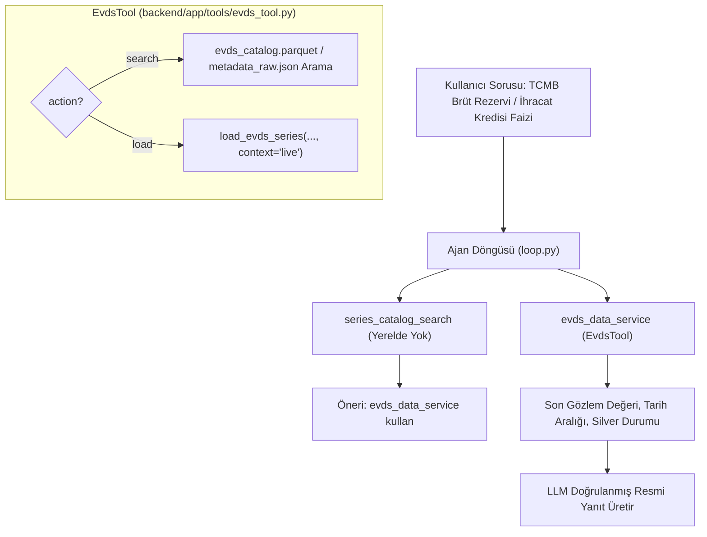

# [F-evds-tool] EVDS Dinamik Veri Keşif ve Canlı Çekme Aracı Uygulama Planı

## 1. Amaç ve Kapsam
Kullanıcı Lakehouse'da henüz yerel olarak bulunmayan bir TCMB serisi sorduğunda (veya semantik katalog aramasında serinin yerel veri tabanında olmadığı anlaşıldığında), ajanın internete gidip haber sitelerinden tahmin yürütmesi yerine **resmi TCMB EVDS API'sini** ve 40.000+ serilik EVDS kataloğunu kullanarak resmi veriyi canlı olarak çekip Lakehouse Silver katmanına kaydetmesini ve kullanıcıya sunmasını sağlamak.

Bu araç, `tool_sozlesmesi_prompt.md` standardına uygun bir `BaseTool` türevi olarak tasarlanacaktır.

---

## 2. Mimari Tasarım ve İş Akışı



### Temel Prensipler
1. **İki Modlu Çalışma (`action`):**
   - `action="search"`: TCMB EVDS kataloğunda (`data/bronze/evds/evds_catalog.parquet`) anahtar kelime veya seri kodu ile arama yapar, eşleşen serilerin kodlarını ve açıklamalarını döner.
   - `action="load"`: Belirtilen EVDS seri kodunu (`TP.DK.USD.A.YTL` gibi) canlı olarak TCMB API'sinden çeker, `silver.duckdb` içine ekler ve son 5 gözlem özeti ile en güncel değeri döner.
2. **Güvenli Katman Ayrımı (`context="live"`):**
   - Canlı çekilen seriler `evds_loader.py` tarafından `context="live"` ile kaydedilir. Bu sayede `nature_reviewed=False` kalır ve `aligned.duckdb` katmanını kirletmez (W-01 kuralı).
3. **Pydantic v2 Sözleşme Uyumu:**
   - `Input` ve `Output` Pydantic modelleriyle tanımlanacak; hata durumunda exception fırlatılmayıp `success: False` ve `error: str` dönülecektir.

---

## 3. Yapılacak Değişiklikler ve Dosya Planı

### [NEW] [evds_tool.py](file:///c:/Projects/kkb/backend/app/tools/evds_tool.py)
* **Sınıf Adı:** `EvdsTool(BaseTool)`
* **Tool Adı (`name`):** `evds_data_service`
* **Tanım (`description`):**
  > *"TCMB EVDS resmi veri servisinden canlı seri arar veya indirir. Lakehouse katalogunda bulunmayan Merkez Bankası serileri için kullanılır. action='search' ile resmi katalogda seri ara, action='load' ile seri kodunu vererek veriyi indir ve son degerini getir."*
* **Input Şeması:**
  ```python
  class Input(BaseModel):
      action: Literal["search", "load"] = Field(
          default="search",
          description="'search': EVDS katalogunda seri arar. 'load': Belirtilen seriyi resmi API'den cekip yukler."
      )
      query: Optional[str] = Field(
          default=None,
          description="Arama terimi (action='search' ise zorunlu; ornek: 'ihracat reeskont', 'brut rezerv')."
      )
      series_code: Optional[str] = Field(
          default=None,
          description="EVDS seri kodu (action='load' ise zorunlu; ornek: 'TP.DK.USD.A.YTL')."
      )
      start_date: str = Field(
          default="01-01-2021",
          description="Baslangic tarihi (DD-MM-YYYY formatinda)."
      )
      end_date: Optional[str] = Field(
          default=None,
          description="Bitis tarihi (DD-MM-YYYY formatinda, varsayilan bugunun tarihi)."
      )
  ```
* **Output Şeması:**
  ```python
  class EvdsSeriesMatch(BaseModel):
      series_code: str
      series_name: str
      datagroup_name: str
      frequency: str

  class Output(BaseModel):
      success: bool
      error: Optional[str] = None
      action: str
      matches: list[EvdsSeriesMatch] = Field(default_factory=list)
      series_info: Optional[dict[str, Any]] = None
      latest_value: Optional[float] = None
      latest_date: Optional[str] = None
      preview: list[dict[str, Any]] = Field(default_factory=list)
      message: Optional[str] = None
  ```

---

### [MODIFY] [tool_registry.py](file:///c:/Projects/kkb/backend/app/agent/tool_registry.py)
* `EvdsTool` sınıfı `tool_registry.py` içerisine import edilip varsayılan olarak kaydedilecek.

---

### [MODIFY] [loop.py](file:///c:/Projects/kkb/backend/app/agent/loop.py)
* Sistem promptundaki talimat güncellenerek ajana:
  > *"Eğer aranan makroekonomik / TCMB serisi yerel katalogda yoksa veya EVDS kaynaklı bir seri gerekiyorsa `evds_data_service` aracını kullanarak önce katalogda ara (`action='search'`), ardından bulunan seri kodunu canlı yükle (`action='load'`)."*
  talimatı eklenecektir.

---

### [NEW] [test_evds_tool.py](file:///c:/Projects/kkb/backend/tests/tools/test_evds_tool.py)
* `EvdsTool` için birim testleri:
  1. `test_evds_search_catalog`: Mock catalog veya `evds_catalog.parquet` üzerinde "enflasyon" veya "rezerv" araması ve `matches` dönüşünün doğrulanması.
  2. `test_evds_load_series_mocked`: `EvdsClient` mock'lanarak `action="load"` çağrısının başarılı çalıştığı, DuckDB'ye `context="live"` olarak kaydolduğu ve `latest_value` döndüğü doğrulanır.
  3. `test_invalid_inputs`: `action="load"` seçilip `series_code` verilmediğinde kontrollü hata (`success=False`) döndüğünün testi.

---

## 4. Doğrulama Planı

1. **Birim Testleri:**
   ```powershell
   powershell -Command "$env:PYTHONPATH='backend'; .venv\Scripts\pytest backend/tests/tools/test_evds_tool.py -v"
   ```
2. **Dinamik Test Senaryosu (`scripts/test_dynamic_tools.py`):**
   * Senaryo 7.7: Yerel DuckDB'de olmayan güncel bir EVDS serisi sorulacak (örn: *"TCMB resmi rezerv rakamları son dönemde ne oldu?"*).
   * Agent'ın `series_catalog_search` -> `evds_data_service` adımlarını başarıyla izlediği teyit edilecek.
