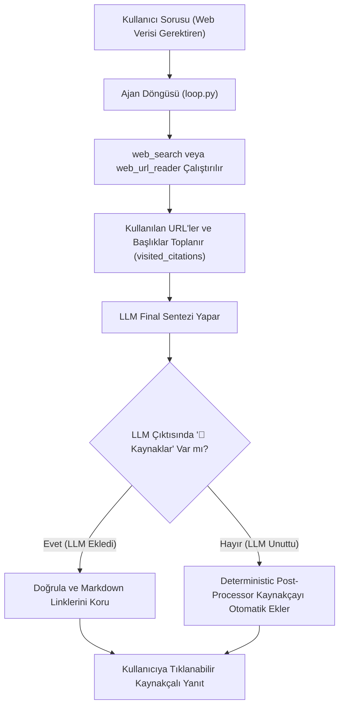

# [F-web-citations] Web ve Harici Veri Aramalarında Tıklanabilir Kaynakça (Citations) Uygulama Planı

## 1. Amaç ve Kapsam
Ajan, internet araması (`web_search`) veya doğrudan web sayfası okuma (`web_url_reader`) araçlarından faydalandığında, kullanıcının finansal veya makroekonomik veriyi doğrudan kaynağından teyit edebilmesi, şeffaflık ve kurumsal güvenilirlik açısından ürettiği nihai cevabın (`final_answer`) en altında **mutlaka tıklanabilir markdown formatında bir kaynakça** sunmalıdır.

### Bağlayıcı Format:
```markdown
### 🔗 Kaynaklar
- [Kaynak Başlığı / Kurum](https://tam-url.com) - Kısa açıklama (örn: Resmi istatistik bülteni veya haber kaynağı)
```

---

## 2. Mimari ve Uygulama Stratejisi (Çift Katmanlı Güvence)

Sadece sistem promptuna kural yazmak LLM'in bazı durumlarda (özellikle uzun sentezlerde) kaynakça eklemeyi unutmasına yol açabilir. Bu yüzden **Çift Katmanlı Güvence (Prompt + Deterministic Post-Processing Fallback)** uygulanacaktır:



### 1. Katman: Sistem Promptu Kuralı
* `loop.py` içindeki sistem promptuna bağlayıcı iş kuralı eklenir:
  > *"Eğer cevabını üretirken `web_search` veya `web_url_reader` araçlarından faydalandıysan, cevabının en sonuna MUTLAKA '### 🔗 Kaynaklar' başlığı altında tıklanabilir markdown linkleri (`[Başlık](URL) - Açıklama`) ekle. Araç sonucunda geçmeyen hiçbir hayali URL uydurma."*

### 2. Katman: Deterministik Post-Processing (Otomatik Koruyucu)
* Döngü boyunca `web_search`'ten dönen `results[].url` ve `title` bilgileri ile `web_url_reader` parametresi olan `url` bilgileri bir `visited_citations` listesinde toplanır.
* Eğer bu araçlar kullanılmışsa ve LLM final cevabında `### 🔗 Kaynaklar` bloğu oluşturmayı unutmuşsa, `loop.py` cevabın sonuna toplanan gerçek linklerden oluşan kaynakça bloğunu deterministik olarak iliştirir.
* Böylece **%100 oranında tıklanabilir kaynakça garantisi** sağlanır.

---

## 3. Yapılacak Değişiklikler ve Dosya Planı

### [MODIFY] [loop.py](file:///c:/Projects/kkb/backend/app/agent/loop.py)
* **Prompt Güncellemesi:**
  Sistem promptuna web araçları kullanıldığında `### 🔗 Kaynaklar` başlığı ve `[Başlık](URL)` formatı zorunluluğu eklenir.
* **Kaynak Takip Mekanizması:**
  Döngü içerisinde `call.name in ("web_search", "web_url_reader")` olduğunda dönen URL ve başlıklar `collected_sources: list[dict[str, str]]` içinde toplanır.
* **Nihai Cevap Zenginleştirme / Doğrulama:**
  Final cevap dönülmeden önce, eğer `collected_sources` doluysa ve metinde `### 🔗 Kaynaklar` bulunmuyorsa, formatına uygun olarak otomatik eklenir.

---

### [NEW] [test_citations.py](file:///c:/Projects/kkb/backend/tests/agent/test_citations.py)
* Kaynakça mekanizması için birim testleri:
  1. `test_citation_added_by_llm_preserved`: LLM kaynakçayı kendi eklediyse formatın korunduğu doğrulanır.
  2. `test_citation_fallback_appended_when_missing`: LLM eklemeyi unutursa deterministik olarak `### 🔗 Kaynaklar` ve markdown linklerinin eklendiği test edilir.
  3. `test_no_citation_for_pure_lakehouse`: Yalnızca `lakehouse_query` veya `change_detection` kullanılan yerel sorgularda gereksiz web kaynakçası eklenmediği doğrulanır.

---

### [MODIFY] [test_dynamic_tools.py](file:///c:/Projects/kkb/scripts/test_dynamic_tools.py)
* Dinamik test runner'a kaynakça doğrulama kontrolü (`assert "### 🔗 Kaynaklar" in final_answer`) eklenir.
* Mevcut `2.1`, `2.2` veya `7.4` gibi web araması içeren senaryolarda kaynakçanın tıklanabilirliği doğrulanır.

---

## 4. Doğrulama Planı

1. **Birim Testleri:**
   ```powershell
   .venv\Scripts\python -m pytest backend/tests/agent/test_citations.py -v
   ```
2. **Dinamik Test Doğrulaması:**
   ```powershell
   .venv\Scripts\python scripts/test_dynamic_tools.py 2.1 7.4
   ```
   * Çıkan cevaplarda `### 🔗 Kaynaklar` başlığı altında çalışan, tıklanabilir bağlantıların bulunduğu gözlemlenir.
